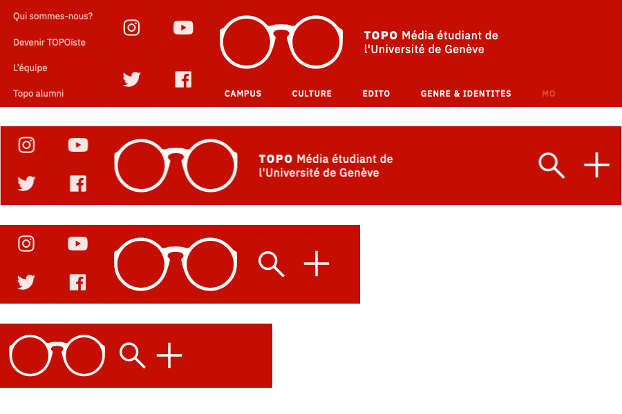
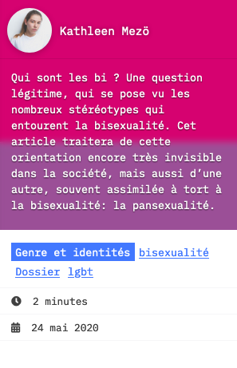
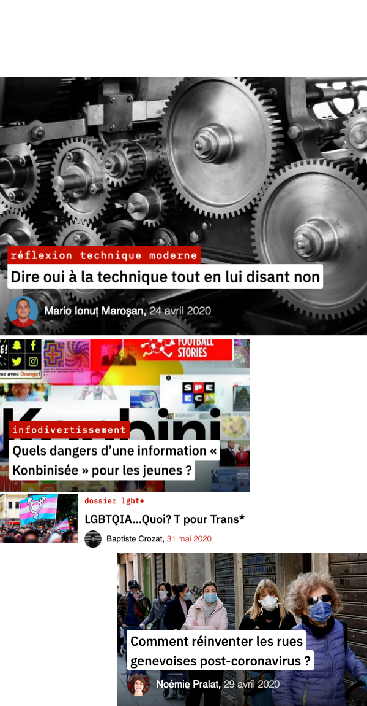

In september 2018, I joined a student media at 
the University of Geneva (where I study). It's called **TOPO**
and here is the website I redesigned : [topolitique.ch](https://topolitique.ch)

Right when I started, the website stopped functioning. The 
system was so old that it just stopped working. At the time,
I didn't intend to do any webmastering, but in fact, it proved a 
good opportunity to 'showcase' my skills in programming and web 
design.

I managed to rebuild the website and recover all the articles
in a month. And by this time, I set out to redesign the 
website from the ground up.

After a year's worth of little fixes, I'm happy to say we 
ended up with a really good site. In my opinion, it's much better
than most swiss news websites. Of course, it adapts 
to the articles written by students, which aren't the professional
reporting you'd see otherwise. They cover more in-depth stories, more
like essays than short articles, so we had to adapt to that.

## Responsive Header

TOPO readers are half mobile users and half desktop, meaning that desktop is still
really relevant in our case. It enables us to really exploit the bigger screen
to enable a better experience. 

For instance, as the more important decisions are made on desktop, we display links
to join our media. Also, we tend to keep social links all the time, until there 
is no more space on screen.

This is an example of added details for desktop users.

## Posts

